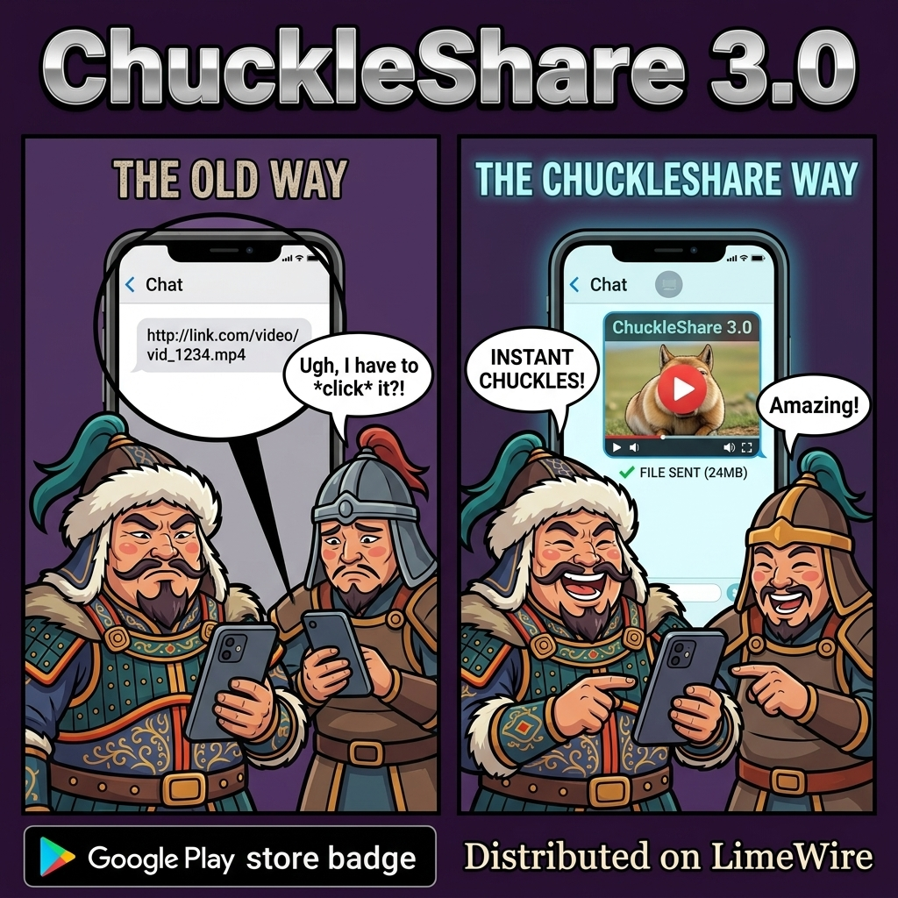

# ChuckleShare 3.0 — The "Warlord" Release

[](https://www.gnu.org/licenses/gpl-3.0)

A native Android application designed to download videos from popular web platforms and share the actual media files directly instead of spamming plain web links in group chats. Highly optimized for target viewers on iOS (e.g. Discord, Telegram) using native video transcoding and remuxing.



## ⚔️ Key Features

- **Direct File Sharing:** Extracts and downloads actual video files (`.mp4`) instead of sending URLs.
- **Session Authentication (Cookies):** Paste browser cookies directly into the application settings dialog to bypass rate limits or login-required barriers on supported media hosts. Features automatic space-to-tab repair for clipboard paste corruption.
- **Nightly Engine Updates:** `yt-dlp` auto-updates from the daily **Nightly** channel (checked at most once every 6 hours, so downloads start instantly in between). The current engine version is shown in the app footer, and a manual update button lives in the settings dialog.
- **iOS Compatibility Transcoder:** Videos are checked for H.264/AAC + faststart compliance; already-compatible files are shared as-is with zero re-processing, container-only issues get a fast stream-copy remux, and only genuinely incompatible codecs trigger a full (veryfast-preset) transcode.
- **Warlord UI Theme:** Custom Jetpack Compose micro-animations featuring a laughing, thumbs-up, or frowning Mongol Khan representing the app states.

---

## 🛠️ How to Build

### Prerequisites
- JDK 17 (a copy is bundled in `jdk-17.0.2/`; `gradle.properties` points `org.gradle.java.home` at it — adjust the path for your machine)
- Android SDK (compile/target SDK 35)

### Build Steps
1. Clone this repository to your local machine.
2. Initialize Gradle and build the release package:
   ```bash
   ./gradlew assembleRelease
   ```
3. The unsigned release APK will be generated at:
   `app/build/outputs/apk/release/app-release-unsigned.apk`
4. Sign the APK using `apksigner` with your keystore:
   ```bash
   apksigner sign --ks <your-keystore> --out ChuckleShare.apk app/build/outputs/apk/release/app-release-unsigned.apk
   ```

---

## ⚖️ Legal & Licensing

This project is licensed under the **GNU General Public License v3.0 (GPL-3.0)**. 

Publishing this project as open-source under GPL-3.0 guarantees full legal compliance with all of its compiled dependencies and wrappers:
- **[youtubedl-android](https://github.com/yausername/youtubedl-android)**: The JNI wrapper library used by this application is licensed under **GPL-3.0**.
- **[FFmpeg](https://ffmpeg.org/)**: Bundled via the JNI wrapper and compiled with video encoding capabilities (`--enable-gpl`), making the binary distribution subject to **GPL-2.0+** (which is fully compatible with GPL-3.0).
- **[yt-dlp](https://github.com/yt-dlp/yt-dlp)**: The core video extractor script is released under the **Unlicense** (Public Domain), allowing free reuse and bundling.
- **[Python](https://www.python.org/)**: The runtime bundled inside the package is licensed under the **PSF License** (GPL-compatible).

By utilizing a GPL-3.0 license and distributing the complete source code, this app fully satisfies all copyleft conditions of its upstream components.

---

## ⚠️ Disclaimer

This software is provided solely for educational and personal backup purposes. The developer does not condone, encourage, or facilitate piracy, copyright infringement, or the unauthorized download of media. 

By using this software, you agree to:
- Comply with all local copyright laws.
- Respect the intellectual property rights of content creators and copyright holders.
- Adhere to the Terms of Service (TOS) of any third-party websites or platforms from which you access or retrieve media.

The user is solely responsible for how they utilize this application and for any copyright violations or terms of service infractions resulting from its misuse.
